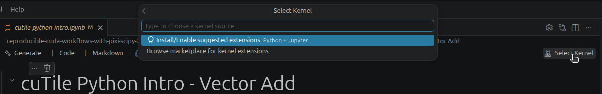
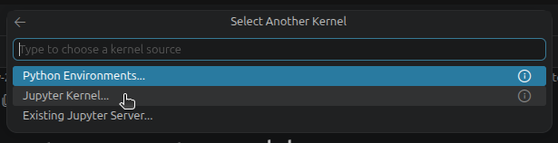
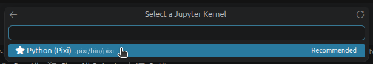
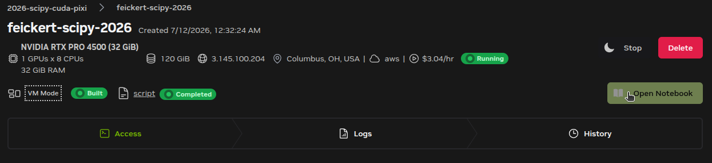
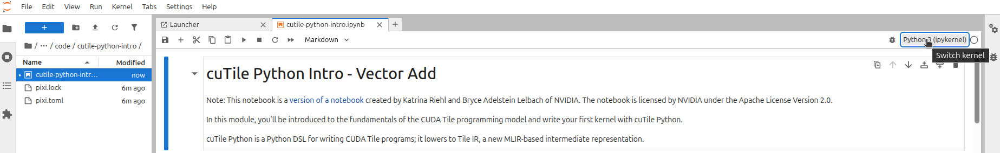
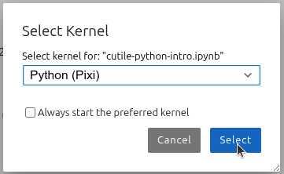

# Introduction to cuTile Python

There are many applications of CUDA in scientific computing and in recent years a large growth of applications in the scientific Python ecosystem with the advent of [CUDA Python](https://github.com/nvidia/cuda-python).
In this section of the tutorial, we will familiarize ourselves with a [recent addition to the CUDA Python ecosystem](https://youtu.be/uZTtViomW6w?si=MTbRATK9d4hfXINd): [cuTile Python](https://docs.nvidia.com/cuda/cutile-python/).
cuTile is a parallel programming model for NVIDIA GPUs and a Python-based {term}`DSL`.

For the purposes of this tutorial, we are not going to fully work through all of the interesting foundations of cuTile and [CUDA Tile](https://github.com/nvidia/cuda-tile).
Instead, we are going to take a high-level approach to learning the cuTile Python API through working through a cuTile demonstration in a [Jupyter notebook in the tutorial source repository](https://github.com/matthewfeickert-talks/reproducible-cuda-workflows-with-pixi-scipy-2026/blob/main/book/code/cutile-python-intro/cutile-python-intro.ipynb).

## Move work over to Brev

Use of CUDA requires an NVIDIA GPU, so the following sections of the tutorial will require access to a machine with an NVIDIA GPU and CUDA driver.
We will use the NVIDIA Brev platform to achieve this.
Part of the tutorial setup [covered Brev setup, login, and instance provisioning](#prepare-brev-instance).
Return to that section now and provision a Brev instance as described.
When you have finished with that return to this section.

## Reviewing Pixi workspace for cuTile

Once you have provisioned and logged into your Brev instance you will find that the instance has already cloned the tutorial source repository under your home directory.
Navigate to the top level of the repository

```
cd ${HOME}/reproducible-cuda-workflows-with-pixi-scipy-2026
```

and then to `book/code/cutile-python-intro`

```
cd book/code/cutile-python-intro
```

We have already provided a Pixi workspace for cuTile, but let's quickly inspect it to make sure that you could create it yourself.

```{literalinclude} code/cutile-python-intro/pixi.toml
:linenos:
:emphasize-lines: 4,5,6,14,16,17
```

In the manifest we:
* Created rich platforms for CUDA support that declare the `__cuda` virtual package on the base platforms
* Added `cutile-python` from conda-forge as well as all of the additional packages used in the notebook
* Added `notebook` and `jupyterlab` to both provide the `ipykernel` dependency needed for interacting through VS Code and to additionally provide Jupyter Lab support for local use

Now make sure that the default environment containing all the dependencies is installed for use with

```
pixi install
```

## Interacting with the cuTile notebook on Brev

To be able to use the environment with cuTile in the Pixi manifest and use the Jupyter notebook `cutile-python-intro.ipynb` on Brev there are two options.

### Connect VS Code to the Brev instance

1. Open a connection from your local machine to the Brev instance with VS Code.

   ```
   brev open $(whoami)-scipy-2026 code
   ```

1. In your VS Code file browser, navigate to `reproducible-cuda-workflows-with-pixi-scipy-2026/book/code/cutile-python-intro/`.
1. Click on the `cutile-python-intro.ipynb` notebook to open it.
1. Switch the ipykernel being used for the notebook by clicking on the "Select Kernel" button on the upper-right-hand side of the screen and selecting the "Install/Enable suggested extensions Python + Jupyter".
   This will install the VS Code extensions groups Python and Jupyter into your Brev instance if they are not already (they should be already as part of the Brev instance startup script).

   

1. After the extensions install, the "Select Another Kernel" menu should open.
   Select "Jupyter Kernel" from the dropdown menu.

   

1. Select "Python (Pixi) `.pixi/bin/pixi`" from the "Select a Jupyter Kernel" menu.

   

   The running kernel name should now show "Python (Pixi)".

You can now execute the notebook in VS Code using the environment from the Pixi workspace!

### Use the Brev instance's Jupyter Lab

1. Visit your Brev instance's "GPU environments" page on https://brev.nvidia.com/ (or just login again with `brev login`).
1. Click on your current running instance (which should be named your values of `$(whoami)-scipy-2026`).
1. Click the "Open Notebook" button on the right-hand side of the screen.
   This will launch a Jupyter Lab instance on your Brev instance.

   

1. Using JupyterLab's file browser on the left-hand side of the screen navigate to `reproducible-cuda-workflows-with-pixi-scipy-2026/book/code/cutile-python-intro/`.
1. Click on the `cutile-python-intro.ipynb` notebook to open it.
1. Switch the ipykernel being used for the notebook by clicking on the default kernel name (Python 3 (ipykernel)) on the upper-right-hand side of the screen and in the "Select Kernel" menu select "Python (Pixi)" (under "Start python Kernel") and then click "Select".

   

   

   The running kernel name should now show "Python (Pixi)".

You can now execute the notebook in Jupyter Lab using the environment from the Pixi workspace!

## Explore cuTile Python in the Jupyter notebook

You can now proceed with [the cuTile notebook example](https://github.com/matthewfeickert-talks/reproducible-cuda-workflows-with-pixi-scipy-2026/blob/main/book/code/cutile-python-intro/cutile-python-intro.ipynb).
