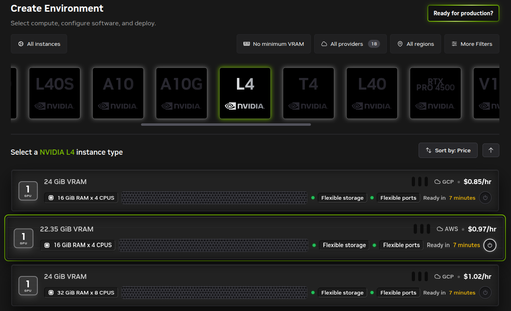

# Setup

## Hardware (optional)

* An NVIDIA GPU

This tutorial focuses on hardware acceleration for {term}`CUDA` environments which require an NVIDIA GPU to use.
While an NVIDIA GPU is not required to be able to work through the tutorial, access to one will be required to run the examples.

:::{important} SciPy 2026 in-person tutorial resources

For the [in-person tutorial at SciPy 2026](https://pretalx.com/scipy-2026/talk/9FQMMN/) (on 2026-07-13) NVIDIA has donated GPU resources through an [NVIDIA Brev platform](https://developer.nvidia.com/brev).
Tutorial participants will be given a code to use at the start of the tutorial by the instructors.
You must be in-person at the tutorial to receive the code.

:::

## Software

This tutorial requires minimal software to be installed in advance:

* A computer running an 64 bit version of Linux, macOS, or Windows.
   - At the moment a laptop is required and an ARM based tablet will not be sufficient.
* [Pixi](https://pixi.prefix.dev/)
* [Git](https://git-scm.com/), if not already familiar with `git` and GitHub, please install [`gh`](https://cli.github.com/) as well to simplify the workflow.
* [Brev CLI](https://docs.nvidia.com/brev/latest/cli/getting-started)
* Highly recommend a IDE like [Visual Studio Code](https://code.visualstudio.com/) or [PyCharm](https://www.jetbrains.com/pycharm/).

### Web Platforms (optional, but encouraged)

* [GitHub](https://github.com/)

For this tutorial we would like you to create your own Git repository where you add the results of your work as you move through the tutorial so that you have a sharable form of what you have learned by the end.
It doesn't _need_ to be GitHub (GitLab.com or some other alternative exist) but for the sake of consistency, the instructions will assume you are using GitHub.

::: {attention} GitHub mandatory two-factor authentication

As [GitHub requires two-factor authentication](https://docs.github.com/en/authentication/securing-your-account-with-two-factor-authentication-2fa/about-mandatory-two-factor-authentication), it is highly recommended that you [generate an SSH key pair](https://docs.github.com/en/authentication/connecting-to-github-with-ssh/generating-a-new-ssh-key-and-adding-it-to-the-ssh-agent) specifically for GitHub, [add the generated SSH key to your GitHub account](https://docs.github.com/en/authentication/connecting-to-github-with-ssh/adding-a-new-ssh-key-to-your-github-account), and then use your SSH keys to connect with GitHub.

:::

## Installation

(install-pixi)=
### Pixi

To install Pixi follow [the installation instructions](https://pixi.prefix.dev/latest/#installation) for your particular machine and then restart your shell.

::::{tab-set}

:::{tab-item} Unix (Linux and macOS) and Windows Terminal
:sync: tab1

```bash
curl -fsSL https://pixi.sh/install.sh | sh
```

:::

:::{tab-item} Windows PowerShell
:sync: tab2

```powershell
powershell -ExecutionPolicy ByPass -c "irm -useb https://pixi.sh/install.ps1 | iex"
```

:::

::::

#### Pixi Shell completions

Additionally, install the [Pixi shell completions](https://pixi.prefix.dev/latest/advanced/installation/#autocompletion) for your particular shell choice.

### Git

You probably already have Git installed on your machine.
You can check with

```bash
command -v git
```

If the command doesn't return a filepath to the `git` executable, first make sure you have [Pixi installed](#install-pixi), as described above, and then run

```bash
pixi global install git
```

You can now use the Git anywhere on your machine.

### GitHub CLI (`gh`)
If you are not already familiar with `git` and GitHub, we recommend installing the [GitHub CLI](https://cli.github.com/) to simplify the workflow.
To install the GitHub CLI, first make sure you have [Pixi installed](#install-pixi), as described above, and then run

```bash
pixi global install gh
```

Then log in to your GitHub account with

```bash
gh auth login
```
You can now use the GitHub CLI anywhere on your machine.

### Brev

#### Brev CLI

::: {warning} Brev on Windows
:class: dropdown

As described in the [Brev docs](https://docs.nvidia.com/brev/latest/cli/getting-started)

> Brev is supported on Windows currently through the Windows Subsystem for Linux (WSL).

To participate in the GPU component of the workshop with Brev on a Windows machine make sure that you have

* [WSL](https://learn.microsoft.com/en-us/windows/wsl/install) installed and configured
* Virtualization enabled in your BIOS
* [Ubuntu 20.04](https://www.microsoft.com/en-us/p/ubuntu-2004-lts/9n6svws3rx71?activetab=pivot:overviewtab) installed from the Microsoft Store

:::

For the portion of the tutorial where GPUs will be used we'll be working on an [NVIDIA Brev instance](https://developer.nvidia.com/brev).
To install the CLI API for Brev, we'll use [`pixi global`](https://pixi.prefix.dev/latest/global_tools/introduction/) so make sure you first have [Pixi installed](#install-pixi), as described above, and then run

```bash
pixi global install brev
```

You can now use the Brev CLI anywhere on your machine.
Check out the CLI options with

```bash
brev --help
```

## Setup a Personal GitHub Repository

To share your work from this tutorial, we will create a GitHub repository to store your code and results.
This will allow you to easily share your work with others and keep track of your progress, or share it with the Brev instance.

1. Create a personal [GitHub account](https://github.com/) _if you don’t have one yet_.
1. Add a new repository to your account through this link: [Create a new repository](https://github.com/new).
1. Name the new repository `reproducible-cuda-scipy-2026`, make it public, and give it a README and an [open source license](https://docs.github.com/repositories/managing-your-repositorys-settings-and-features/customizing-your-repository/licensing-a-repository) (e.g. MIT License).

To streamline this we recommend using the [GitHub CLI](https://cli.github.com/) to create the repository.

Feel free to change any of the options below to suit your needs, but the following command will create a new public repository with a README, a Python [`.gitignore`](https://docs.github.com/en/get-started/git-basics/ignoring-files), and an MIT [license](https://docs.github.com/en/repositories/managing-your-repositorys-settings-and-features/customizing-your-repository/licensing-a-repository):

```bash
gh repo create reproducible-cuda-scipy-2026 \
   --public \
   --description "Reproducible CUDA Accelerated Workflows for Scientists with Pixi at SciPy 2026" \
   --add-readme \
   --gitignore Python \
   --license MIT \
   --clone
```

Because of the `--clone` option, this will also clone the newly created repository to your local machine.
Now you can navigate to the newly created repository directory:

```bash
cd reproducible-cuda-scipy-2026
```

Now you have a GitHub repository set up to store your work from this tutorial.

## Prepare Brev Instance
#### Create an NVIDIA Brev account

To access the NVIDIA Brev instance you'll also need to create an NVIDIA Brev account.

* Visit https://login.brev.nvidia.com/signin and fill in your email address and agree to the terms of use.
* Check your email address that you used to create the account for verification email with further instructions.

#### Login to Brev account with Brev CLI

To validate your Brev account and your Brev CLI install, login to your Brev account from the command line with [`brev login`](https://docs.nvidia.com/brev/latest/cli/getting-started).

```bash
brev login
```

::: {tip} Login info

1. You'll be prompted to either enter or confirm the email address associated with your NVIDIA Brev account.
1. You'll then be prompted to login to your account via a browser where you can provide your authentication credentials.
1. Upon login success you'll be shown your Brev account on the GPUs tab.

:::

#### Prepare an NVIDIA Brev instance

::: {warning} Resource use requires billing information

Provisioning Brev instances requires billing information be added to your account.
If you are running this at the in-person SciPy 2026 tutorial, **wait** to do these steps until after you are given the code at the start of the tutorial.

:::

Later on in the [SciPy 2026 tutorial](https://pretalx.com/scipy-2026/talk/9FQMMN/), we'll use a coupon code to provision a new Brev GPU instance environment.

The particular configuration we'll be using is:
* 1x NVIDIA L4 GPU
* 24GiB VRAM
* 16GiB Ram x 4 CPUS
* GCP

::: {important}

We recommend that you run the following commands to create a new instance with this configuration:

```bash
curl -sLO https://raw.githubusercontent.com/matthewfeickert-talks/reproducible-cuda-workflows-with-pixi-scipy-2026/refs/heads/main/book/code/setup_brev.sh
brev create $(whoami)-scipy-2026 --type g7.2xlarge --startup-script @./setup_brev.sh
```

:::


You _can_ select it from the [Brev new environment page](https://brev.nvidia.com/environment/new), but we recommend using the command line to ensure that you get the correct setup.

[](https://brev.nvidia.com/environment/new)


#### Access the NVIDIA Brev instance on your machine

Once your Brev instance has been provisioned and built, connect to it either an interactive shell over SSH with

```bash
# start an ssh session into the instance
brev shell $(whoami)-scipy-2026
```

or

```bash
# open the instance in VS Code
brev open $(whoami)-scipy-2026
```

#### Prepare your Brev instance

Once you have access to the Brev instance, you can use it like any other Linux machine and install any additional software you need.
Ensure that your `~/.bashrc` has the following at the bottom

```bash
export PATH="/home/ubuntu/.pixi/bin:$PATH"
eval "$(pixi completion --shell bash)"
```

If it doesn't, the startup script failed to run, and you should execute the following in your shell


```bash
curl -fsSL https://pixi.sh/install.sh | bash
echo 'eval "$(pixi completion --shell bash)"' >> ${HOME}/.bashrc
. ${HOME}/.bashrc
```

Please install the following useful software on your Brev instance:

```bash
pixi global install git gh bat
```

#### Cleaning up after the tutorial

::: {attention}

**After** the tutorial is finished, remember to logout and delete your Brev instance so that it doesn't sit idle but still using credits.
You can do this from the command line after you exit your session with

```bash
brev delete $(whoami)-scipy-2026
```

:::
